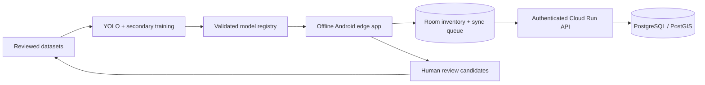

# Architecture

## System boundary

Android owns capture, local inference, timestamp alignment, tracking, geolocation, local
inventory, and lossless queued synchronization. Cloud services consolidate observations and
inventory; they are not required for core detection. Training consumes only reviewed data.

## Edge data flow

Camera frames retain monotonic capture timestamps and the complete crop/resize/rotation mapping.
Timestamp buffers interpolate GNSS and orientation state to that time. YOLO yields broad class,
confidence, and a source-image bounding box. A category router invokes digit classification,
symbol classification, OCR, or direct interpretation. A tracker aggregates class evidence and
world rays. A commit policy accepts an estimate only after minimum observation count, baseline,
intersection angle, residual, positive depth, GNSS quality, and uncertainty requirements pass.

The detector is YOLO. The runtime/format remains an evidence-based decision (candidate exports
include TFLite and ONNX-compatible Android runtimes); no format is designated until operator
compatibility and real-device measurements exist.

## Core contracts

- `taxonomy_version` travels with datasets, models, detections, observations, and API records.
- All times state their clock domain; Android sensor/camera matching uses monotonic elapsed time.
- Geographic values use WGS84 `(latitude, longitude, altitude)`; geometry uses local metric ENU.
- Camera rays use the documented optical frame and explicit device/mount/camera rotations.
- Every inventory coordinate includes method, uncertainty, observation count, provenance, and
  model/calibration versions.
- Client-generated UUIDs and idempotency keys make retries safe; observations are immutable.

## Storage model

Room will store `DriveSession`, `TrafficSignObservation`, `TrafficSign`, `CameraCalibration`,
`MountCalibration`, `ModelMetadata`, and `SyncQueueItem`. The cloud mirrors immutable raw
observations and maintains versioned canonical sign estimates in PostGIS. Deduplication uses
spatial proximity together with sign meaning, travel direction, uncertainty overlap, and time;
proximity alone is insufficient at intersections.

## Model lifecycle

Artifacts are immutable and content-addressed. Promotion requires dataset provenance, license
review, frozen test-set evaluation, taxonomy compatibility, export validation, and Android
smoke/benchmark results. Android verifies checksum/signature and compatibility, activates
atomically, and retains the prior model for rollback. Field predictions enter a review queue,
never the training set automatically.

## Cloud architecture and cost controls

Initial cloud scope is one autoscaling-to-zero Cloud Run API, Cloud SQL PostgreSQL/PostGIS,
Cloud Storage for approved crops/models, Secret Manager, and structured logging. Infrastructure
as code and budget alerts are required before deployment. Cloud SQL is the main always-on cost;
development instances should be intentionally scheduled or replaced by local PostGIS until the
sync contract is stable. Service-account keys, database secrets, and signing keys are forbidden
from Git.

## Major risks

- Small/distant signs and domain shift through windshields limit detector recall.
- In-vehicle magnetic interference and time-domain mistakes dominate bearing error.
- Weak baseline or nearly parallel rays create deceptively precise but unstable coordinates.
- Camera intrinsics vary by lens, resolution, stabilization, zoom, and device.
- OCR on tiny reflective signs can be confidently wrong; temporal consensus is necessary.
- Public dataset labels and licenses differ; silent taxonomy merging is prohibited.
- Background execution, thermal throttling, and OEM camera behavior vary across Android devices.

Cloud/dashboard polish is intentionally behind the first real end-to-end offline milestone.

